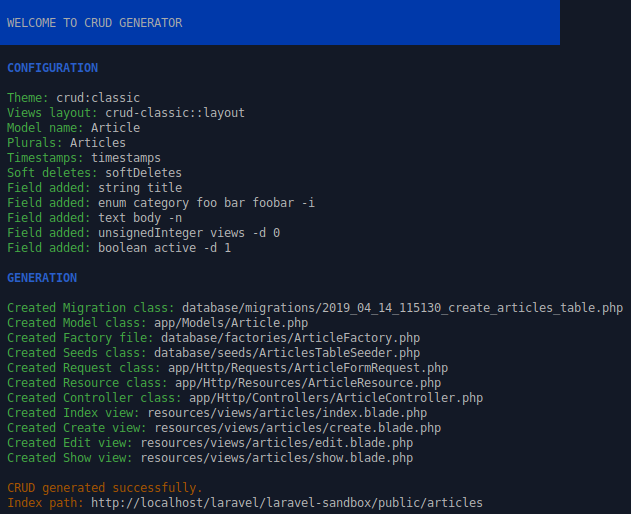

# Laravel CRUD Generator

<p align="center">
    
</p>

## Table of content

* [Overview](#overview)
* [Installation](#installation)
* [Why this package?](#why-this-package)
* [Conventions](#conventions)

Digging deeper:

* [Usage](doc/usage.md)
* [CRUD command options](doc/crud-options.md)
* [Custom CRUD theme](doc/custom-theme.md)

## Overview

This package allows to generate CRUDs in a breath for your Laravel 5.5+ applications.  
Please have a look to [this short video on Vimeo](https://vimeo.com/330304646) to see it in action.

Using the SignedInput syntax, it offers a concise and handy way to define the model fields.

It is designed to be easily extended in order to create custom CRUDs (aka _themes_).  
Each theme is available as a dedicated console command.

Two themes are provided :

* **crud:classic** generates a fully fonctionnal "classic" CRUD.  
_It creates for you : migration, model, factory, seeder, request, resource, controller, blade views and routes._
* **crud:api** generates a fully fonctionnal REST API CRUD.  
_It creates for you : migration, model, factory, seeder, request, resource, controller and routes._

## Installation

Simply import the package as a dev dependency into your Laravel application:

```
composer require --dev bgaze/laravel-crud
```

You can publish the package configuration to `/config/crud.php`:

```
php artisan vendor:publish --provider=Bgaze\Crud\ServiceProvider
```

And classic themes views to `/resources/views/vendor/crud-classic`:

```
php artisan vendor:publish --tag=crud-classic-views
```

## Why this package?

Laravel is my favorite PHP framework.  
But using it daily, at work and for my private projects, I realized that each time I create a model, 
I was wasting a lot of time doing repetitive tasks instead of really working on the application itself:

1. Generate classes: model, migration, controller, request, factory, seeder, ...
2. Define the table fields into migration.
3. Create the rules into the request class.
4. Create the model faker into factory.
5. Define CRUD actions into controller.
6. Register controller routes.
7. Create CRUD views and model forms.

I believe that this process can be automated a lot to produce a generic functionnal CRUD 
that we just need to customize, keeping the focus on the application logic.

The key for that is to define the Model table fields from whom, sticking to the framework conventions, a lot of things can be deducted.  
For instance request rules or form fields: a non-nullable field is required, an enum field is often a select.

But even if CRUD generation logic will be almost the same, the files to generate can vary a lot depending on the tools used.  
For instance, using classic HTML or Vue.js, a CRUD files will be very different.

So this package goals are to provide:

* A handy way to define required informations for a CRUD generation.
* A robust and extensible base to create easily custom CRUD generators (named **themes**).
* Two base themes:
    + REST API CRUD.
    + Basic HTML CRUD using Blade templates. 

## Conventions

> This section explain very important concepts required to use the package.  
> Please read it carrefully.

CRUD generator need to manipulate Model name in order to generate required ressources.  
As a convention, we designate by:

* **FullName:** the model's name including namespace without the `App` part. 
* **Plural:** the FullName with last segment pluralized.
* **Plurals:** the FullName with each segments pluralized.

**Examples:**

```
Models:
    \App\MyGrandParent  
    \App\MyGrandParent\MyParent  
    \App\MyGrandParent\MyParent\MyChild

FullName:
    MyGrandParent  
    MyGrandParent\MyParent  
    MyGrandParent\MyParent\MyChild

Plural:
    MyGrandParents  
    MyGrandParent\MyParents  
    MyGrandParent\MyParent\MyChildren

Plurals:
    MyGrandParents  
    MyGrandParents\MyParents  
    MyGrandParents\MyParents\MyChildren
```
