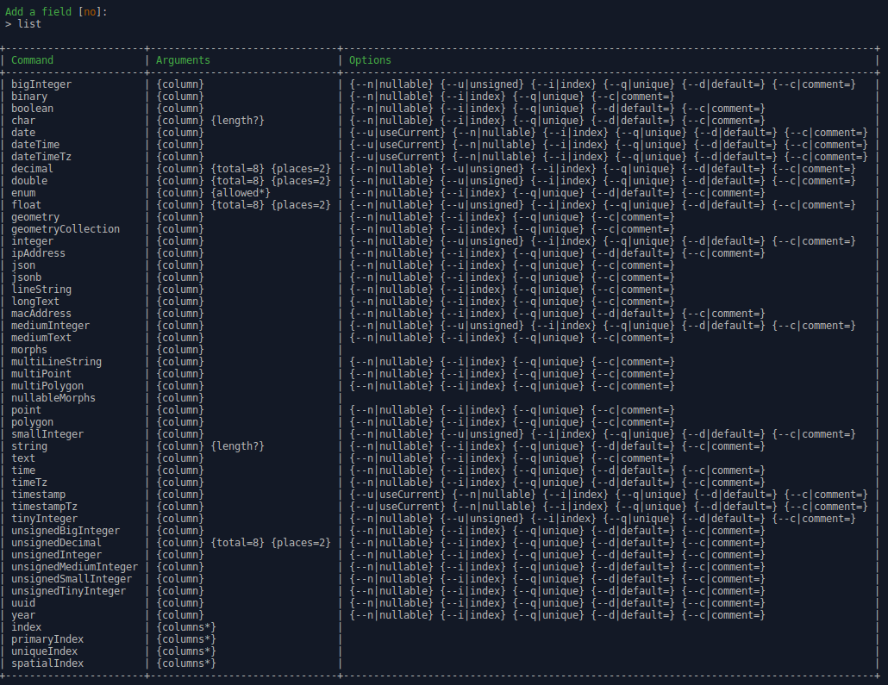

# Laravel CRUD Generator

<p align="center">
    
</p>

## Overview

This package allows to generate CRUDs in a breath for your Laravel 5.5+ applications.

Using the SignedInput syntax, it offers a concise and handy way to define the model fields.

It is designed to be easily extended in order to create custom CRUDs (aka _themes_).  
Each theme is available as a dedicated console command.

Two themes are provided :

* **crud:classic** generates a fully fonctionnal "classic" CRUD, creating for you : migration, model, factory, seeder, request, resource, controller, views and routes.
* **crud:api** generates a fully fonctionnal REST API CRUD, creating for you : migration, model, factory, seeder, request, resource, controller and routes.

## Demo

[This short video on Vimeo](https://vimeo.com/330304646) shows the creation of a CRUD for an **Article** model containing following fields:

* **category:** indexed enum field, with _foo_ and _bar_ as values.
* **title:** a mandatory string field.
* **body:** a nullable text field.
* **active:** a boolean field with _0_ as default value.
* Timestamps and softDeletes fields.

## Why this package?

Laravel is my favorite PHP framework.  
Using it daily, at work and for my private projects, I've noticed that each time I create a model, 
I have to do the same repetitive tasks before starting to really work on the application itself:

1. Generate classes: model, migration, controller, request, factory, seeder, ...
2. Define the table fields into migration.
3. Create the rules into the request class.
4. Create the model faker into factory.
5. Define CRUD actions into controller.
6. Register controller routes.
7. Create CRUD views and model forms.

Sticking to the framework conventions, I believe that this process can be automated a lot to produce
a generic functionnal CRUD that we just need to customize, keeping the focus on the application logic.

The key for that is to define the Model table field, from whom a lot of things can be deducted.  
For instance request rules (a non-nullable field is required) or form fields (an enum field is often a select).

But even if the logic behind CRUD generation will be almost the same, the files to generate can vary a lot depending on the tools used in the app.  
For instance, using classic HTML or Vue.js, a CRUD files will be very different.

So this package goals are to provide:

* A handy way to define required informations for a CRUD generation.
* A robust and extensible base to create easily custom CRUD generators (named **themes**).
* Base CRUD themes for REST API and classic HTML (using Blade templates). 

## Conventions

> This section explain very important concepts required to use the package.  
> Please read it carrefully.

CRUD generator need to manipulate Model name in order to generate required ressources.  
As a convention, we designate by:

* **FullName:** the model's name including namespace without the `App` part. 
* **Plural:** the FullName with last segment pluralized.
* **Plurals:** the FullName with each segments pluralized.

**Examples:**

```
Models:
    \App\MyGrandParent  
    \App\MyGrandParent\MyParent  
    \App\MyGrandParent\MyParent\MyChild

FullName:
    MyGrandParent  
    MyGrandParent\MyParent  
    MyGrandParent\MyParent\MyChild

Plural:
    MyGrandParents  
    MyGrandParent\MyParents  
    MyGrandParent\MyParent\MyChildren

Plurals:
    MyGrandParents  
    MyGrandParents\MyParents  
    MyGrandParents\MyParents\MyChildren
```

## Installation

Simply import the package as a dev dependency into your Laravel application:

```
composer require --dev bgaze/laravel-crud
```

You can publish the package configuration to `/config/crud.php`:

```
php artisan vendor:publish --provider=Bgaze\Crud\ServiceProvider
```

And classic themes views to `/resources/views/vendor/crud-classic`:

```
php artisan vendor:publish --tag=crud-classic-views
```

## Usage

Each CRUD theme is registred as a dedicated command.  
Please call any CRUD command with the `-h` switch to see a complete description of arguments and options. 

### Generation process

The only mandatory argument for CRUD commands is the FullName of the model.  
When invoked, depending on provided options, a wizard will drive you through following steps.

1. **Plurals definition**  
Plurals is automatically suggested based on model's FullName and english language.  
Please pay attention to that important step and correct the proposed value if needed, otherwise simply confirm.
2. **Timestamps definition**  
Choose the option you need, simply confirm to add standart timestamps fields.
3. **SoftDeletes**  
Choose the option you need, simply confirm to add standart softDelete fields.
4. **Migration fields**  
Define your model's table field (see detailed explanations below).
5. **Review and confirm CRUD configuration**  
Review the displayed summary of the CRUD and confirm to start files generation.  

To use your CRUD, simply run `php artisan migrate` and access to the displayed index path.  
You can also create some data for your model using the generated seeder class.

### Defining migration fields

When dealing with CRUDs, a tricky part is often to define model's properties (aka table fields) because fields types and syntax vary a lot.  
ser input needs to be guided and validated. 

I believe that the Laravel commands signature syntax is very great to do that in a concise and handy way.  
So I've kinda "hacked" it to make that step as easy as possible.  
Please note that you can also use that trick for your own needs using the `Bgaze\Crud\Support\SignedInput` class.

To add a field, enter its type (the CRUD wizard provides autocompletion) followed with required arguments and validate.  
To get the detailed syntax of a type, validate with no arguments.

Finally, to see a detailed list of available types, enter `list` and validate.

**Examples:**

```
Adding a foo integer field, nullable and indexed:
    Input:  integer foo -n -i
    Result: $table->integer('foo')->nullable()->index();

Adding a bar varchar field, with a length of 100 and a unique constraint:
    Input:  string bar 100 -q
    Result: $table->string('foo', 100)->unique();

Adding a baz enum field, with 'user' and 'admin' as values, and 'user' as default value:
    Input:  enum baz user admin -d user
    Result: $table->enum('baz', ['user', 'admin'])->default('user');

Adding a primary index on firstname and lastname fields:
    Input:  primaryIndex firstname lastname
    Result: $table->primary(['firstname', 'lastname']);
```

**Field type help:**


**Field types list:**



### No interraction.

Any step of the process can also be set using options.  
Any option directly passed to the command will be skipped by the wizard.

Example, CRUD generation without any interractions:

```
php artisan crud:classic Article -n -s=none \
-c "string title" \
-c "enum category foo bar foobar -i" \
-c "text body -n" \
-c "unsignedInteger views -d 0" \
-c "boolean active -d 1" \
&& php artisan migrate \
&& php artisan db:seed --class=ArticlesTableSeeder 
```
